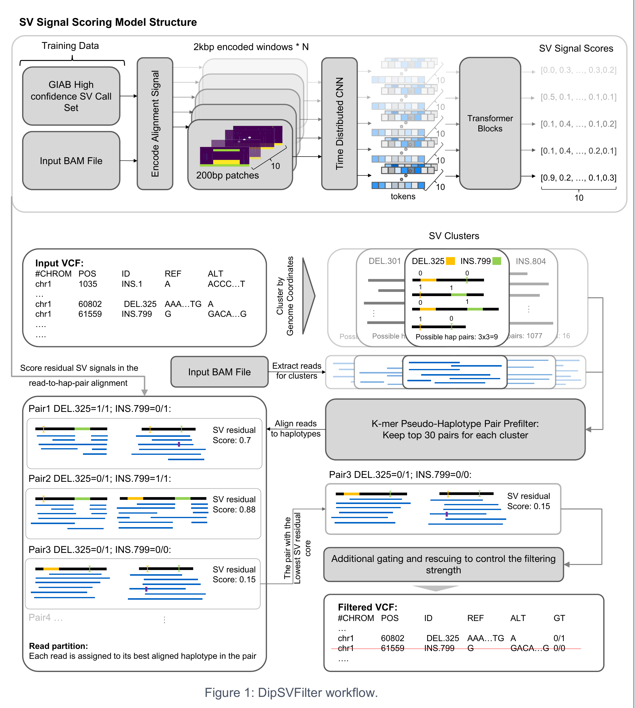

# DIP-SV-FILTER

A post-calling structural variant (SV) filtering tool for long-read sequencing data. DIP-SV-FILTER reduces false positives in SV callsets by jointly modeling clustered SV candidates as alternative diploid sequence hypotheses, using a time-distributed CNN-Transformer classifier to score residual alignment signal after local realignment.

## Method overview

DIP-SV-FILTER treats filtering as a local diploid sequence explanation problem: which pair of candidate haplotypes best explains the observed reads? This supports joint evaluation and re-genotyping of nearby calls, where overlapping events, alignment artifacts, and alternative variant representations can make independent SV scoring unreliable.



*Pipeline overview extracted from Figure 1 of the project poster, “DipSVFilter: filtering false-positive structural variants through cluster-aware diploid hypothesis modeling,” by Yichen Henry Liu, Rohit Khurana, and Xin Maizie Zhou. The component workflow is described below.*

1. **Cluster candidates.** Group nearby SVs from an input VCF into local regions.
2. **Construct pseudo-haplotypes.** Apply alternative allele combinations to the reference sequence and enumerate unordered diploid pairs, including self pairs.
3. **Prefilter with k-mers.** Compare reference-state and alternate-state-specific k-mers with local reads. Each informative read supports its more compatible haplotype within a pair; retain the strongest pairs for alignment-based evaluation.
4. **Realign and partition reads.** Assign reads to their better-aligned haplotype within each retained pair and encode SV-overlapping windows.
5. **Score residual signal.** Predict SV-signal probabilities in 200 bp subwindows. The poster describes focus masks, top-fraction averaging within haplotype–SV combinations, and an event-balanced mean across SVs.
6. **Select and export.** Choose the pair with the lowest residual signal, update diploid genotypes, and normally remove variants assigned `0/0`, preserving unevaluated variants.

The classifier measures remaining SV-like alignment signal. A lower residual score indicates that a candidate diploid sequence better explains the reads.

## Implementation status

The repository provides a connected component workflow from candidate VCF preprocessing through haplotype construction, k-mer prefiltering, pair-aware read assignment, focused residual scoring, and filtered VCF export. Run the commands below in order or adapt the root `submit.slurm` example for your scheduler.

`realign_with_secondary.py` remains available as a separate cluster-level helper. The pair-aware workflow uses `align_cluster_reads_to_haps.py` to align reads separately to each retained haplotype.

Current scope and limits:

- VCF preprocessing retains sequence-resolved, single-alternate insertions and deletions and regenerates IDs; it does not perform general VCF normalization.
- Haplotype construction uses input genotypes to generate alternatives, excludes overlapping active variants on the same haplotype, and skips clusters with more than 1,024 genotype combinations before overlap filtering.
- The k-mer prefilter defaults to retaining 30 pairs when filtering is applied and bypasses filtering for small candidate sets.
- Data, trained checkpoints, and generated outputs are not bundled with the package.

## Setup

Requires Python 3.13+ and [uv](https://docs.astral.sh/uv/).

```bash
uv sync --locked  # install the package and dependencies from the lockfile
uv run pre-commit install --hook-type pre-commit --hook-type pre-push
```

Pair-aware realignment requires `minimap2` and `samtools` on `PATH`. Use a coordinate-sorted, indexed BAM and matching reference FASTA/FAI and VCF contig names. BAM region arguments are 0-based, half-open.

## Usage

Run commands from the repository root. Paths below are examples; supply your own data and checkpoints. The prefilter output directory connects the alignment, encoding, scoring, and export stages.

### Haplotype construction and k-mer prefiltering

Preprocess a sorted candidate VCF, construct cluster FASTAs, and rank diploid pairs using the original reference-aligned reads:

```bash
mkdir -p output

uv run python src/construct_haplotypes/preprocess_variants.py \
  --variant-file-path data/variants/HG002.vcf.gz \
  --output-variant-file-path output/candidates.vcf

uv run python src/construct_haplotypes/construct_haplotypes.py \
  --variant-file-path output/candidates.vcf \
  --reference-file-path data/reference.fa \
  --output-directory output/haplotypes

uv run python src/filter_contig_pairs.py \
  --fasta output/haplotypes \
  --bam data/HG002_chr21.bam \
  --output-directory output/prefilter \
  --keep-top-pairs 30
```

The constructor writes cluster FASTAs named `chrom_start-end.fasta`. The prefilter exports retained-pair tables, haplotype FASTAs, local reads, and evidence summaries.

### Pair-aware filtering and VCF export

After preprocessing, haplotype construction, and prefiltering above:

```bash
uv run python -m align_cluster_reads_to_haps output/prefilter \
  --preset map-hifi --jobs 2 --minimap2-threads 4
uv run python -m encode_pair_target_windows output/prefilter --threads 2
uv run python -m classify_contig_pairs \
  --model output/best_model.pt --cluster-dir output/prefilter
uv run python -m export_filtered_vcf \
  --cluster-dir output/prefilter --input-vcf output/candidates.vcf \
  --output-vcf output/filtered.vcf --decision-tsv output/decisions.tsv
```

Use a checkpoint trained with the current model architecture. Alignment writes `hap_bams/`; encoding writes `pair_target_windows/`, including feature matrices and focus annotations. Pair scoring writes `pair_classification.tsv`, sorted by residual score. Export uses the first pair, normally removes `0/0` calls, and preserves unevaluated records. Use the ID-normalized `candidates.vcf` so the IDs match the haplotype metadata. This workflow evaluates a single sample; the exporter assigns its resulting genotype to every sample column, so supply a single-sample VCF.

Encoding balances tied read assignments and, by default, rescales assigned count/depth channels to full assigned depth. Export supports optional per-variant-type allele rejection and rescue thresholds; they are disabled by default. The Slurm example retains the collaborator's INS rejection threshold of 0.95 and DEL rescue threshold of 0.5. Tune these only with appropriate validation.

For Slurm, submit from the repository root with `VCF`, `BAM`, `REFERENCE`, `MODEL`, and `OUTPUT` environment variables set, and specify your cluster account/partition in `sbatch` options. `PRESET` defaults to `map-hifi`. The script uses uv and retains intermediate outputs.

### Optional cluster realignment

For one generated cluster FASTA (replace the example filename with an actual output):

```bash
uv run python src/realign_with_secondary.py \
  --fasta output/haplotypes/chr21_1000000-1010000.fasta \
  --bam data/HG002_chr21.bam \
  --output-directory output/realigned \
  --preset map-hifi \
  --threads 4
```

Use `--preset map-ont` for Oxford Nanopore reads. This helper produces a sorted BAM and, by default, its index; it does not partition reads for individual diploid pairs.

### Feature extraction

Extract MAMNET-style alignment features from a BAM region into per-window `.npy` matrices (one `(window_size, 9)` matrix per 200 bp window by default) plus heatmaps:

```bash
uv run python src/featurizers/extract_features.py \
  --bam data/HG002_chr21.bam \
  --contig chr21 \
  --start 1000000 \
  --end 1002000 \
  --window-size 2000 \
  --output-directory output/features
```

The example sets a 2 kb window for model-compatible input. The standalone extractor defaults to 200 bp windows, which cannot be passed directly to the classifier.

### Labeled data generation

Generate the labeled `(2000, 9)` feature matrices consumed by the model, along with a `labels.txt` of 10 per-subwindow binary labels:

```bash
uv run python src/featurizers/generate_labeled_data.py \
  --bam data/HG002_chr21.bam \
  --vcf data/variants/HG002.vcf.gz \
  --fai data/reference.fa.fai \
  --output-directory output/features \
  --threads 4
```

### Training

Train the CNN-Transformer classifier on pre-extracted feature matrices:

```bash
uv run python src/models/train.py \
  --train-directory data/baseline/features/training/matrices \
  --validation-directory data/baseline/features/validation/matrices \
  --test-directory data/baseline/features/test/matrices \
  --output-directory output \
  --wandb-mode disabled
```

Training logs to [Weights & Biases](https://wandb.ai) by default (`--wandb-mode disabled` to turn off).

There is one trainer, `src/models/train.py`. To reproduce the collaborator's training settings, add `--epochs 30 --worker-count 12 --lr-scheduler constant --wandb-mode disabled`. Use `--labels-file-path path/to/labels.txt` for a shared labels file; otherwise labels are resolved per split. Feature shapes are validated before training. `src/models/export_false_samples.py` exports misclassified windows and requires explicit checkpoint, split, and output paths.

Prepare training, validation, and test directories separately; the labeled-data generator does not create these splits automatically. Training defaults to 20 epochs, batch size 64, AdamW with learning rate `2e-4` and weight decay `1e-3`, and cosine annealing. The best checkpoint is selected by validation elementwise F1. Outputs include `best_model.pt`, `final_model.pt`, `history.json`, `test_metrics.json`, and `run_summary.json`.

### Inference

Run a trained model on new feature matrices:

```bash
uv run python src/models/inference.py \
  --checkpoint-file-path output/best_model.pt \
  --split-directory data/baseline/features/test/matrices \
  --output-file-path output/predictions.tsv
```

The output TSV contains `file_name`, `predicted_probabilities`, and `predicted_labels`, with ten comma-separated values in each prediction vector. The default probability threshold is 0.5.

## Features and model

Model inputs are logarithmically transformed NumPy arrays of shape `(2000, 9)`. Channel order is fixed:

1. Mismatch count
2. Deletion count
3. Soft/hard clipping count
4. Insertion count
5. Mean insertion length
6. Maximum insertion length
7. Mean deletion length
8. Maximum deletion length
9. Read depth

Each window is divided into ten contiguous 200 bp subwindows. `labels.txt` associates each matrix filename/path with ten comma-separated binary labels, separated from the filename by a tab. Training searches for this file in the matrix directory or its parent. Labels are generated from variant-type-aware VCF overlap and alignment-based checks. Insertions label the patch containing their anchor; other variants require at least 50 bp overlap. SV window starts are jittered by up to 50 bp, and negative sampling targets 50 windows per chromosome. These rules apply to newly generated datasets; regenerate labels before comparing experiments that use different labeling rules.

`SVHunterModel` encodes each nine-channel subwindow with a shared CNN. The resulting embeddings are projected to 100 dimensions, augmented with subwindow positional embeddings, and processed by three transformer blocks with four attention heads. A 128-unit MLP predicts one logit per subwindow, trained with `BCEWithLogitsLoss`. Attention dropout is 0.3 and head dropout is 0.4. The model does not apply the former input LayerNorm or positional input channel.

This is the only supported architecture. Checkpoints from the previous 128-dimensional/four-block model are incompatible; use a matching collaborator checkpoint or retrain. Both window inference and pair classification load checkpoints strictly.

Evaluation reports elementwise precision, recall, F1, and accuracy; exact-match accuracy; and any-SV precision, recall, and F1. These are window/subwindow classification metrics, not final VCF benchmarking metrics. Changing feature order, normalization, window dimensions, or label semantics requires coordinated model changes and retraining.

## Project structure

```
src/
  construct_haplotypes/
    preprocess_variants.py          # explicit-sequence INS/DEL selection and ID assignment
    construct_haplotypes.py         # clustered pseudo-haplotype FASTA generation
  featurizers/
    extract_features.py             # BAM region -> per-window (200, 9) .npy matrices + heatmaps
    extract_indels.py               # intra/inter-alignment SV signature extraction
    generate_labeled_data.py        # BAM+VCF+FAI -> (2000, 9) matrices + labels.txt
    parse_sample_specific_strings.py # sample-specific string analysis
  models/
    architecture.py                 # CNN-Transformer model definition
    train.py                        # training loop, metrics, checkpointing
    inference.py                    # batch inference from checkpoint
    export_false_samples.py         # labeled prediction diagnostics
  filter_contig_pairs.py            # read-local k-mer prefilter for haplotype pairs
  realign_with_secondary.py         # optional cluster-level realignment
  align_cluster_reads_to_haps.py    # per-haplotype minimap2 alignment and BAM indexing
  encode_pair_target_windows.py    # read assignment and focused feature encoding
  classify_contig_pairs.py          # residual scoring and pair ranking
  export_filtered_vcf.py            # genotype updates and filtered VCF export
  utils.py                          # VCF/reference helpers
submit.slurm                        # configurable scheduler workflow example
docs/images/
  pipeline.png         # pipeline overview extracted from the poster
plans/                              # local planning documents (ignored)
data/
  baseline/features/{training,validation,test}/
    labels.txt                      # per-split label file
    matrices/                       # .npy feature matrices
  mixed-coverage/                    # symlink to the mixed-coverage training data
```

The `data/` entries describe the local workspace layout, not versioned datasets.

## Research context

The project abstract reports preliminary F1 improvements in complex SV clusters relative to CSV-FILTER and SAMPLOT-ML. The poster presents HG002 benchmarking against the GIAB high-confidence SV set using PacBio HiFi and Oxford Nanopore reads, with comparisons to CSV-Filter, SVJedi-graph, and Kanpig. Performance varies by caller, variant type, and sequencing platform; these reported experiments do not establish an improvement for every setting.

The method description and pipeline figure above draw on the supplied project abstract and poster. The reported performance is not established by the small integration smoke checks used to verify this code.

## Checks

```bash
uv run ruff check .
uv run ruff format --check .
uv run pre-commit run --all-files
```

Pre-commit and pre-push hooks check file hygiene, run Ruff lint and formatting, and strip notebook outputs. To apply formatting manually, run `uv run ruff format .`.

The existing script paths remain supported. `uv sync` also installs the modules under `src/`, so commands such as `uv run python -m models.train --help` work. Realignment additionally requires `minimap2` on `PATH`.

Personal agent instructions, agent configuration, skills, and `plans/` are local and ignored by Git.
